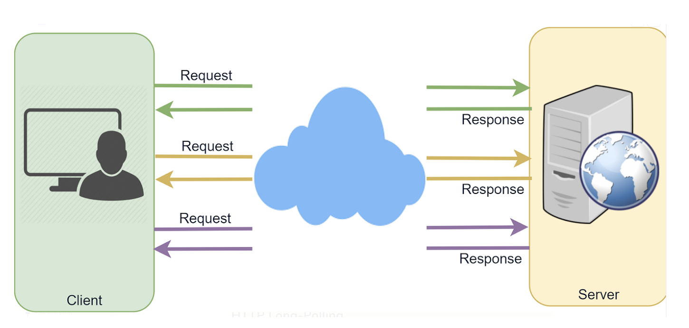
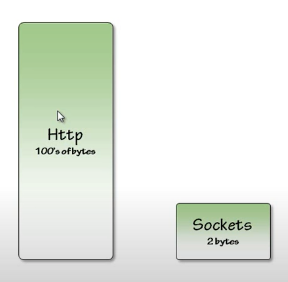

### WebSockets

- half duplex communication where at a time a single way communication is allowed between two devices and if you want to fake two way communication you have to have signles going back and forth between device rapidly.
- whereas in full duplex we have communication going both ways.
- http works like a half duplex channel and web sockets which ( works like a full duplex ) is not only a instance of something you create in a browser to communicate with a server but also includes its own protocol and websocket frame to send back and forth instead of traditional http header. 

### Real time data before web sockets

#### AJAX Polling

Remember ajax is a technique (async javascript and XML), here the XML is a bit misleading as nowadays majority of data being transfered is either in normal text format or JSON.

- ajax - polling
    - AJAX allows web pages to be updated asynchronously by exchanging data with a web server behind the scenes. This means that it is possible to update parts of a web page, without reloading the whole page.
    - Polling is a standard technique used by the vast majority of AJAX applications. The basic idea is that the client repeatedly polls (or requests) a server for data. The client makes a request and waits for the server to respond with data. If no data is available, an empty response is returned

- AJAX is a developer's dream, because you can:
    - Update a web page without reloading the page
    - Request data from a server - after the page has loaded
    - Receive data from a server - after the page has loaded
    - Send data to a server - in the background

    

Steps in ajax 
- The client opens a connection and requests data from the server using regular HTTP.
- The requested webpage sends requests to the server at regular intervals (e.g., 0.5 seconds).
- The server calculates the response and sends it back, just like regular HTTP traffic.
- The client repeats the above three steps periodically to get updates from the server

#### HTTP Long-Polling

Its a variation of Polling - the client requests information from the server exactly as in regular polling, but with the expectation that the server may not respond immediately. That’s why this technique is sometimes referred to as a “Hanging GET.”

- If the server does not have any data available for the client, instead of sending an empty response, the server holds the request and waits until some data becomes available.
- Once the data becomes available, a complete response is sent to the client. The client then immediately re-requests information from the server so that the server will almost always have an available waiting request that it can use to deliver data in response to an event.

Steps in Long-Polling
- The client makes an initial request using regular HTTP and then waits for a response.
- The server delays its response until an update is available or a timeout has occurred.
- When an update is available, the server sends a complete response to the client.
- The client typically sends a new long-poll request, either immediately upon receiving a response or after a pause to allow an acceptable latency period.
- Each Long-Poll request has a timeout. Therefore, the client has to reconnect periodically after the connection is closed due to timeouts.

### Web Sockets

### HTTP Header vs. Socket Header

